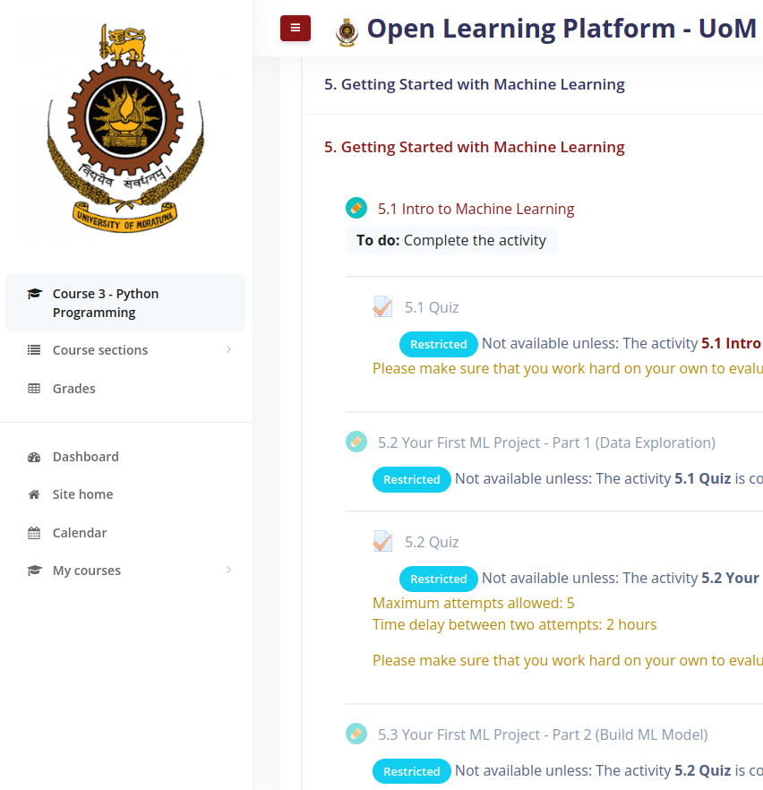

# Machine Learning

## What is machine learning?

A way of developing a system to extract knowledge from data to perform a task.

## Key Definitions

# PyTorch

PyTorch is an open source machine learning framework based on the Torch library, used for applications such as computer vision and natural language processing, primarily developed by Facebook's AI Research lab (FAIR). It is free and open-source software released under the Modified BSD license. Although the Python interface is more polished and the primary focus of development, PyTorch also has a C++ interface.

**A number of pieces of deep learning software are built on top of PyTorch, including Tesla Autopilot, Uber's Pyro, Hugging Face's Transformers, PyTorch Lightning, and Catalyst.**

## PyTorch provides two high-level features:

- Tensor computing (like NumPy) with strong acceleration via graphics processing units (GPU)
- Deep neural networks built on a tape-based automatic differentiation system

# Predicting Rain

## No rain today!

# Machine Learning Workflow

# Google CoLab

https://colab.research.google.com/

https://colab.research.%google.com/drive/1nVmB4EnmD3Z-PwvZZng0cGF322Xmi0Ef?usp=sharing

# Iris Dataset

# Support Vector Machine

# Accuracy 96.666666666%

